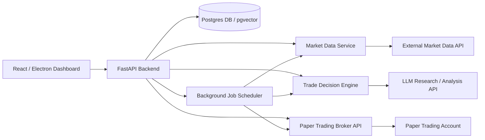
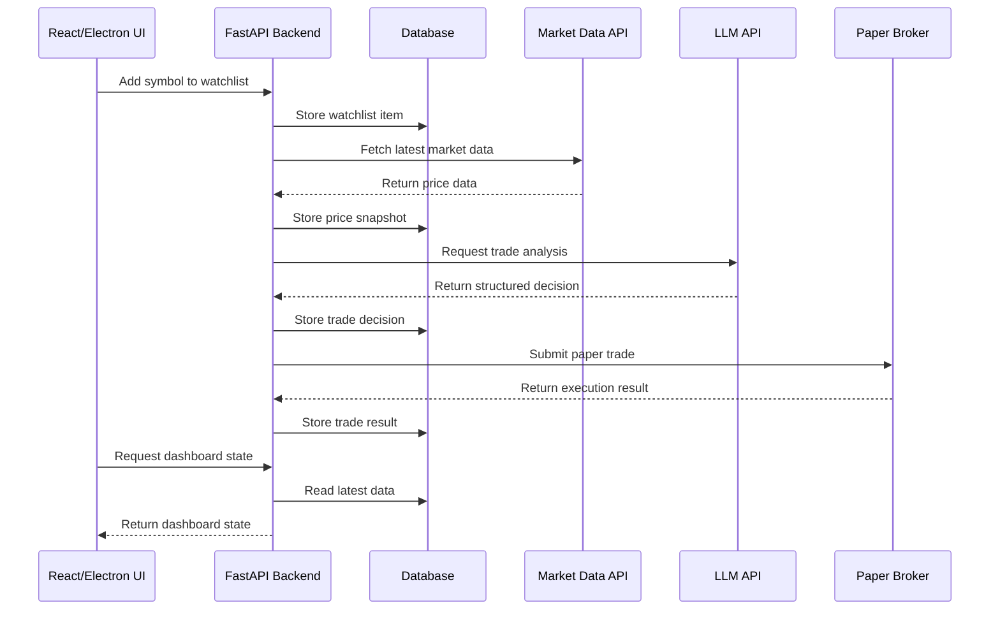

# Trading AI Bot Architecture

## Overview

This project is a local-first trading research and paper-trading system. The goal is to collect market data, generate trade decisions, validate them, store results, and display system state in a lightweight desktop dashboard.

## High-Level Architecture

## Core Components

### React / Electron Dashboard

Shows watchlist symbols, latest prices, trade decisions, job status, and portfolio performance.

### FastAPI Backend

Owns the API layer for the app. Handles requests from the desktop dashboard, coordinates services, validates inputs, and reads/writes data.

### Database

Stores watchlist items, price snapshots, trade decisions, executed paper trades, jobs, and system logs.

### Market Data Service

Fetches prices, volume, and other market information from an external provider.

### Trade Decision Engine

Uses rules and/or an LLM to generate BUY, SELL, or HOLD decisions with confidence scores and rationale.

### Paper Trading Broker API

Executes simulated trades through a paper trading account.

### Background Job Scheduler

Runs recurring jobs such as fetching prices, generating decisions, executing paper trades, and updating portfolio state.

## Initial Data Flow

## First Version Scope

The first version should focus on:

- Adding and listing watchlist symbols
- Saving price snapshots
- Creating trade decisions
- Storing paper trade results
- Displaying state in the dashboard

## Out of Scope for V1

- Real-money trading
- Advanced portfolio optimization
- Complex risk engine
- Multi-user authentication
- Production deployment
- High-frequency trading